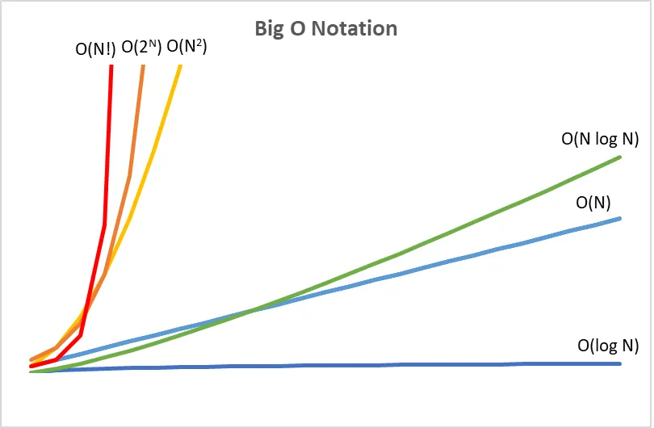

# Run Time
* **Uses big O notation:** a mathematical notation that describes the limiting behavior of a function.
* It helps you determine when your algorithm is getting faster or slower. 


## Asymptotic Notation
These tables sort algorithms from slowest to fastest using Asymptotic Notation:
* **o:** upper bound.
* **Ω:** lower bound (often in context of best case - but not necessarily).
* **Θ:** same for both




## Algorithms
| Algorithm      | O             | Ω             |  Explanation | Conditions |
|----------------|:-------------:|:-------------:|--------------|------------|
| Selection Sort |  O(N^2)       |     Θ         | Complexity is directly related to the size of the inputs| Even best case, a comparison of all inputs still needs to happen. |
| Bubble Sort    |  O(N^2)       |     Ω(1)      | Complexity is directly related to the size of the inputs| Advantageous if data is either sorted or mostly sorted. |
| Merge Sort     |  O(N log N)   |     Θ         |  |Space needed in auxillary array. |
| Linear Search  |  0(N)         |     Ω(1)      | Complexity is directly related to the size of the inputs — the algorithm takes an additional step for each additional data element. | Useful when sorting first would be inefficient. |
| Binary Search  |  O(log N)     |     Ω(1)      | We eliminate half the options each time - the algorithm takes an additional step each time the data doubles. | Data must be sorted. |
| ???            |  O(1)         |               | Finite number of steps that never changes | |


# Data Structures
In C, you can invent your own data types with their own names.
**Example** array called people with person as a new data structure that we get to define.
```
person people[]

#typedef: define a new type
#struct: a data structure

typedef struct
{
  string nae;
  string number;
}
person;

```

# Comparing Algorithms

# Recursion
Ability for a function to call itself.
Each time it calls itself, it should search a smaller portion of the problem.